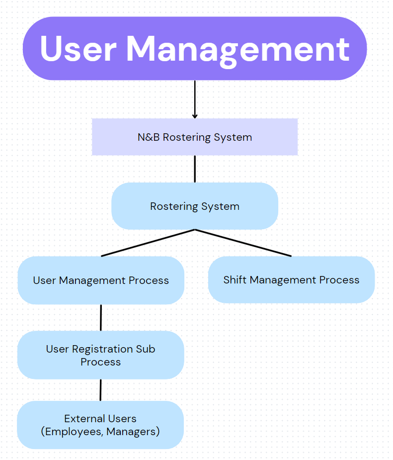

# Rostering System Prototype

## Description

### Purpose
The purpose of this project is to create a digital rostering system for workplace scheduling. The current manual and somewhat inefficient process will be replaced with a streamlined digital solution to enhance efficiency, accuracy and overall management of work schedules.

### Functionality / Features
1. **User Registration and Login:**
    - Users will be able to register and log in to the system, providing a personalized experience.

2. **Shift Booking and Changes:**
    - Users can view available shifts and book or change them based on their preferences.
    - Shift changes can be coordinated with colleagues through the system.

3. **Leave Management:**
    - Users can apply for leave digitally that specifies dates and reasons.
    - The system will maintain a leave history which includes sick leave for each user for the current year.

4. **Location-Based Clock In/Out (Future Addition):**
    - Users may eventually have the ability to clock in and out at their current locations.
    - Overtime can be automatically calculated based on clocked hours (to be implemented in the future).

### Target Audience
The target audience for this rostering system includes employees and managers within the workplace. It aims to provide a user-friendly platform for both scheduling managers and staff to streamline the rostering process.

### Tech Stack
The proposed tech stack for this prototype includes:
- Frontend: HTML, CSS, JavaScript, React
- Backend: Node.js, Express
- Database: MongoDB
- Authentication: JWT
- Additional Tools: Git for version control

This tech stack is chosen for its flexibility, scalability and compatibility with web development. It allows for a responsive and interactive user interface while providing a robust backend for data management.

# Data Flow Diagram of the Website

## User Management Process

## User Registration Sub Process

## Shift Management Process

## Shift Booking Sub Process

## Shift Change Request Sub Process

# Application Architecture Diagram

# User Stories

## 1. User Registration and Login:
- As a new employee I want to be able to register with the workplace rostering application using my email and password.
- As a registered user I want to be able to log in securely and access the rostering system.

## 2. Shift Booking and Changes:
- As an employee I want to view available shifts and book them based on my preferences.
- As an employee I want to request a shift change with a colleague and receive notifications based on the approval status.
- As a manager I want to have the ability to approve or deny shift change requests to ensure proper coverage.

## 3. Leave Management:
- As an employee I want to apply for leave by specifying the dates and reason.
- As an employee I want to view my leave history, including sick leave for the current year.
- As a manager I want to review and approve/deny leave requests to maintain adequate staffing levels.

## 4. Location-Based Clock In/Out:
- As an employee I want to clock in and out of my shifts at my current location using the application.
- As an employee I want the system to automatically calculate my working hours including overtime if applicable.

## 5. Overtime Calculation:
- As a manager I want the system to automatically calculate and track overtime hours for each employee.
- As an employee I want to view my accumulated overtime hours in the system.

## 6. Notification Center:
- As a user I want to receive notifications for approved leave, shift changes and other important updates in the rostering system.

## 7. User Profile Management:
- As a user I want to update my profile information, including contact details and preferred communication methods.

## 8. Calendar Integration:
- As a user I want the ability to sync my rostering schedule with external calendars for better personal organization.

## 9. Reporting and Analytics:
- As a manager I want access to reports and analytics on employee attendance, leave trends and overtime to support data-driven decision-making.

## 10. Employee Preferences:
- As an employee I want to set preferences for specific types of shifts or workdays to improve overall job satisfaction.

## 11. Security and Privacy:
- As a user I want assurance that my personal and work-related data is secure and only accessible by authorized personnel.

## 12. Accessibility:
- As a user I want the application to be accessible on various devices (desktop, mobile) to facilitate easy access and usability.

# Wireframes

## Website Front Page

## Website Rostering & Calendar

## Phone Application Login

## Phone Application Rostering & Calendar

# Trello Screenshots

## Beginning of Planning

## Partial Completion of Planning

## Finish of Planning
